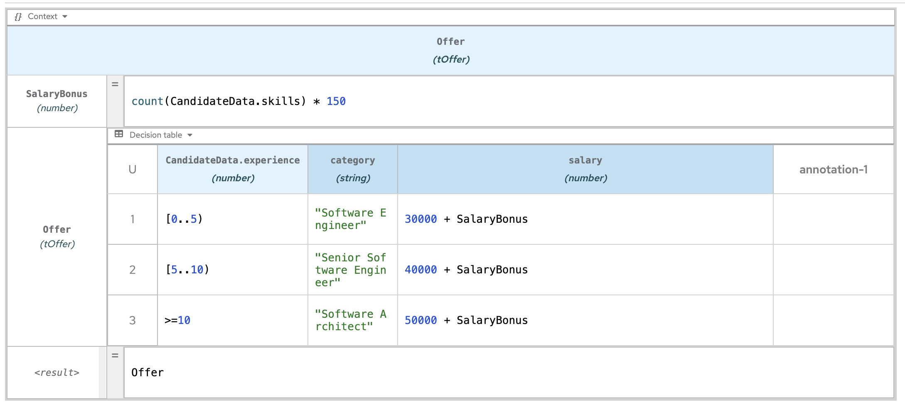

# BAMOE 9 Enablement - Lab

This project contains the lab for the BAMOE 9 enablement.

## Objectives

In this lab, we will be using the VM already set up for BAMOE 9.1 usage.
We will be starting all services and deploy a sample project which contains a business process.
This project is part of the BAMOE 9.1 distribution samples and includes a docker-compose configuration aiming at starting all needed services.

## Steps

### TechZone

Connect to the BAMOE 9.1 TechZone VM: 

<TODO: URL to connect>

### Detail of the set up

<TODO: This VM is using Windows as Operating System>
<TODO: the Maven repository has already been set up in the XXX folder which contains the BAMOE 9 distribution>

### Sample project: jbpm-compact-architecture-sample

The project that we will be using is stored in the <TODO: C:/> folder.
On the desktop, a batch file  

The business process is a basic one detail a hiring process.

## Use the Canvas

<TODO: we will not use the Canvas for the lab, but since it is installed in the VM, we will play with it>
<TODO: load the following BPMN file stored in XXXX>
<TODO: instructions to load>

