# BAMOE 9 Enablement - Lab

This project provide details and instructions for the lab for the BAMOE 9 enablement.

Note that this lab does not intend to teach what BPMN or DMN specifications are, nor to teach how to design business processes or business rules. Its objectives is to show what features and tooling are featured as part of BAMOE 9.1 release, and to get some practice on a specific simple use case.


## Important

Please keep in mind that BAMOE 9.1.x release is **Tech Preview** for stateful processes use cases and is not meant for Production. 
Therefore, some features and functionalities are either non provided or still being tested.
The 9.2 release scheduled for Q4-2024 will be the first supported version of BAMOE 9 powered by Kogito.

Note that 9.1 is supported for stateless business processes i.e. which do not require persistence.


## Objectives

In this lab, we will be using the VM already set up for BAMOE 9.1 usage in IBM Technology Zone.
We will be starting all services and deploy a sample project which contains a business process.
This project is part of the BAMOE 9.1 distribution samples and includes a *docker-compose* configuration aiming at starting all needed services.


## Steps

### Technology Zone

Connect to the BAMOE 9.1 Technology Zone VM, either using Microsoft Remote Desktop or within a Chrome browser.
<region>.services.cloud.techzone.ibm.com:XXX is the URL, replacing with the port assigned to you.
The VMs are Windows-based and the credentials to login are: user: `techzone`, password: `IBMDem0s!`


### Detail of the set up

Your VM has already been set up for a BAMOE 9.1 usage, including:

- JDK 17
- Visual Studio Code & BAMOE editors
- Maven
- GIT client
- A local Maven repository for the BAMOE 9.1 distribution, located in <TODO>
- Docker CLI
- Podman
- A sample of the compact architecture which we will be using as a lab
- A script to run a *docker-compose* YAML file
- Canvas


### Sample project

We will take a look at the project that we will benusing for this lab. 
The project that is located in the `C:\kogito-examples\kogito-quarkus-examples\jbpm-compact-architecture-example` folder.

We will use VSCode to edit all projects artifacts.  In a Windows Command Prompt (type `cmd` in the search bar), navigate to the `C:\kogito-examples\kogito-quarkus-examples\jbpm-compact-architecture-example\` folder, and type `code .`.  This will open an instance of VSCode and load the project.  Close all editor that will open.

In this project, a business process (defined as BPMN) and business rules (defined as DMN) can be found under the `src\main\resources` folder.
Open both `src\main\resources\hiring.bpmn` and `src\main\resources\NewHiringOffer.dmn` file in VSCode and get familiar with them.

The business process is a basic one detail a hiring process.
The hiring process aims at identifying if a candidate is a good fit, following the given workflow:

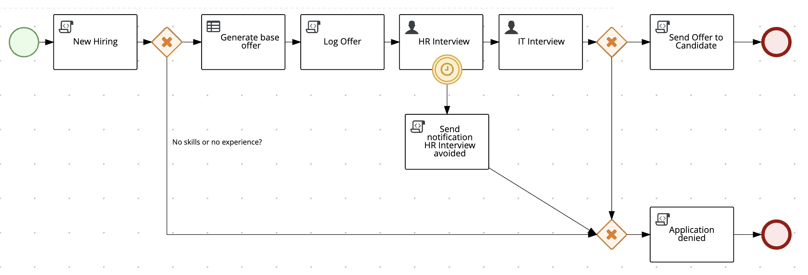

The data model used by the business process is the following one. It includes 1 input object (*CandidateData*) and 1 output object (*Offer*).

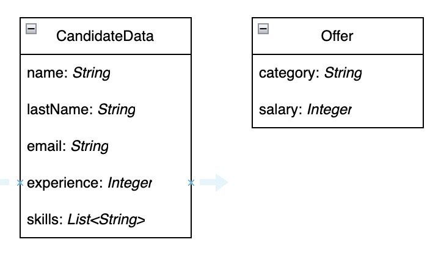

In the process, an automatic decision is made to compute the offer and is using business rules implemented as DMN.

- DMN model:

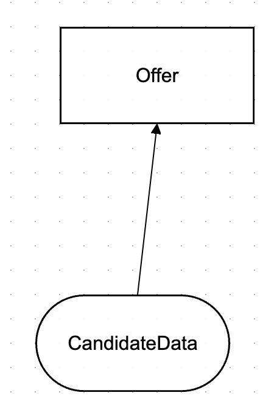

- DMN Decision Table:

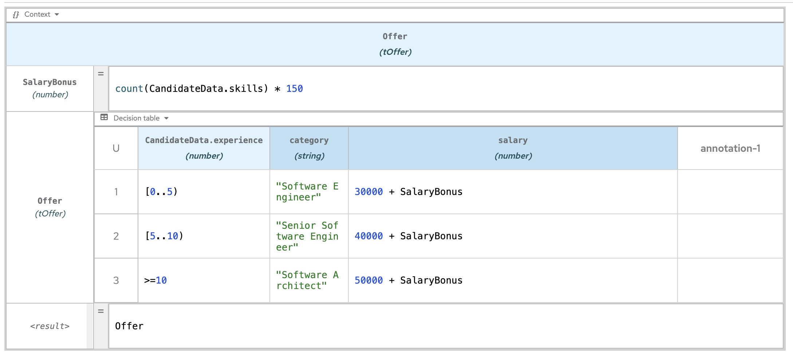

It also includes 2 human tasks corresponding to a human resource interviewer followed by an IT interviewer, both defined as human tasks.
A few other tasks are defined, mostly script tasks for logging purposes.

For more information about the project, please refer to the README.

BPMN specification and BAMOE includes many more types of tasks, but we will only be using a few of them for this lab.


This project also includes a POM file which contains all libraries dependencies needed for the project, as well as BAMOE 9 extensions, such as the ones for the 2 consoles.


### Start

On the desktop, the `start-compact.bat` batch file needs to be run. 
This will start all following services needed by the project that we will be using:

- PostgreSQL database service (port 5432) - this database is needed for this sample because the project contains a stateful business process which requires persistence
- PgAdmin (port 8055) - the UI to management the database
- Keycloak (port 8480) - software to handle security
- Kogito example service (port 8080)
- Management Console (port 8280) - UI to manage the process instances
- Task Console (port: 8380) - UI to manage the task inbox

All these services are started as containers and deployed onto Podman.

Please note that the *docker-compose* is useful for testing purposes but in Production clients would most likely not use this way to deploy.
The projects containing the business logic (i.e. business processes and business rules) are to be built and deployed on Quarkus, which is actually done for you using the *docker-compose* file.


### Interact with the process

- In a new Chrome tab, open PGAdmin
    - URL: http://localhost:8055
    - Check out the BAMOE 9 tables by expanding `Servers > kogito > Databases > kogito > Schemas > public > Tables`
- In a new Chrome tab, open the Management Console
    - URL: http://localhost:8280
    - Login using the following credentials: user: jdoe, password: jdoe.  This user and his business roles have been added at startup in the keycloak configuration
    - Note that there are no process instance visible yet
- In a new Chrome tab, open the Task Console
    - URL: http://localhost:8380
    - You should not need to login again as the SSO is taken care of by the keycloak component
    - Note that there are no human task assign to this user
- In a new Chrome tab, open the Swagger UI 
    - URL: http://localhost:8080/q/swagger-ui
    - Note that the REST endpoints are specific to the business process and have been automatically generated
- Start a process instance
    - Using Swagger and the `/hiring` **POST** endpoint, create a new process instance by clicking on `Try it out` and using the following input data (Note that instead of using Swagger, you could use the `cURL` command line interface):
```json
{
  "candidateData": {
    "name": "Jon",
    "lastName": "Snow",
    "email": "jon@snow.org",
    "experience": 5,
    "skills": ["Java", "Kogito", "Fencing"]
  }
}
```

If the operation is successful, you should get a result similar to the following, depending on your input data:
```json
{
  "id": "a1b52e1d-a9c8-4478-a17c-05427cba777e",
  "offer": {
    "category": "Senior Software Engineer",
    "salary": 40450
  }
}
```

This `id` corresponds to the process instance ID which will need to be used for later interaction with the process instance.


- In the management console, refresh the list of process instances. The newly created one should now show. 

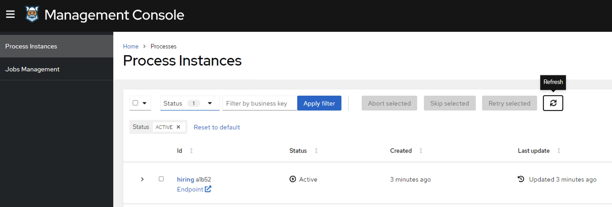

If you had created multiple process instances, they would all show on that console.

- Click on the process instance ID that you just created, you will get its details.

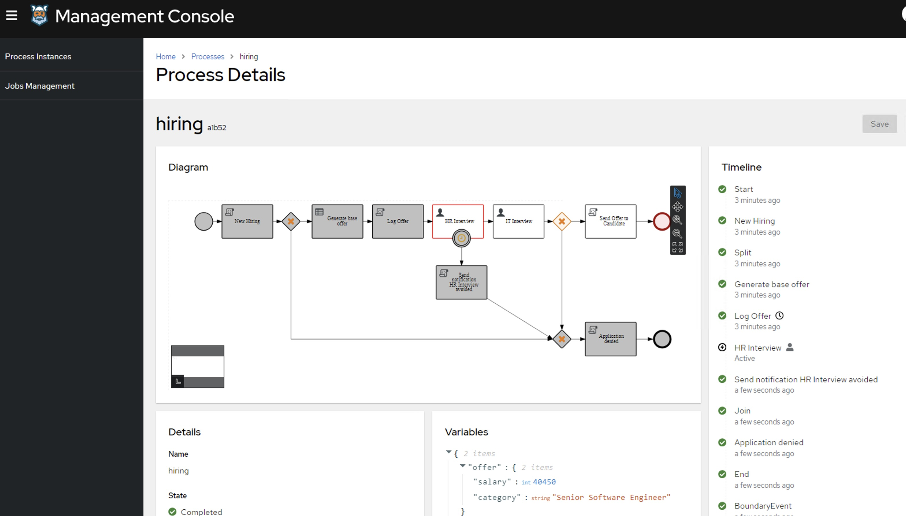

You can see the information related to this process instance, including the data, the timeline, 
Keep in mind that all this information is persisted in the BAMOE database.


- In the Task Console, refresh the list of tasks. You should now see the task that needs to be completed first, which corresponds to the Human Resource interviewer task.
Please note that there is a boundary timer on this task set to 180 seconds, so if you do not complete this task within 3mn, it will move to the next step of the process.  In such a case, you will need to recreate a new process instance as you did before.

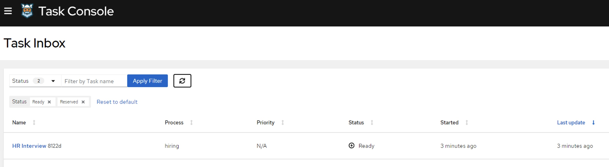

- Click on the task instance you want to work on, this will take you to a form that list the data for this task to complete. You may approve or not the condidate. 
Click on the `Complete` button at the bottom of the page. This will tell the process that this task instance is complete and needs to move to the next one, which is the IT interview.

- Switch back to the Process Console, you should see in the diagram that the process instance is now waiting on the IT interview task.

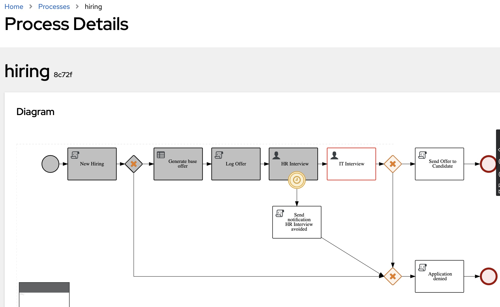


## GraphQL queries

BAMOE 9 features GraphQL queries which will allow to send requests to fetch information about process instances.
In a new tab of your browser, go to the following URL: http://localhost:8080/q/graphql-ui/
This will open the GraphQL UI which will let you send queries.
Send a query requesting for information about a specific process instance, by typing the following query:
```graphql
{ ProcessInstances {
  id,
  processId,
  processName,
  state,
  nodes {
    name,
    type,
    enter,
    exit
  }
} }
```

You should get the requested information about all process instances:
```json
{
  "data": {
    "ProcessInstances": [
      {
        "id": "56158ef1-b53c-4b43-8404-e59aa3472566",
        "processId": "hiring",
        "processName": "hiring",
        "state": "ACTIVE",
        "nodes": [
          {
            "name": "Start",
            "type": "StartNode",
            "enter": "2024-09-21T03:39:13.452Z",
            "exit": "2024-09-21T03:39:15.749Z"
          },
          {
            "name": "New Hiring",
            "type": "ActionNode",
            "enter": "2024-09-21T03:39:13.455Z",
            "exit": "2024-09-21T03:39:15.749Z"
          },
          {
            "name": "Split",
            "type": "Split",
            "enter": "2024-09-21T03:39:13.465Z",
            "exit": "2024-09-21T03:39:15.749Z"
          },
          {
            "name": "Generate base offer",
            "type": "RuleSetNode",
            "enter": "2024-09-21T03:39:13.466Z",
            "exit": "2024-09-21T03:39:15.748Z"
          },
          {
            "name": "Log Offer",
            "type": "ActionNode",
            "enter": "2024-09-21T03:39:13.979Z",
            "exit": "2024-09-21T03:39:15.747Z"
          },
          {
            "name": "HR Interview",
            "type": "HumanTaskNode",
            "enter": "2024-09-21T03:39:13.981Z",
            "exit": null
          }
        ]
      }
    ]
  }
}
```


## Use the Canvas

In this lab, we have used VSCode to view and edit our business process and business rules. 

BAMOE 9 also features Canvas, a web application UI for designing and comitting artifacts. Canvas ia accessible on the TechZone VMs at the following URL:  http://localhost:9090

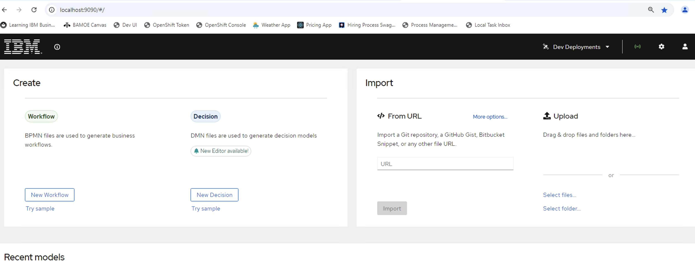

For IBM BAMOE clients, Canvas is provided as a tool which can connect to a remote enterprise GIT repository.
It also allows non-technical users to participate in a BAMOE project without the need to use an IDE such as VSCode.

Upload the following file into Canvas: `C:\kogito-examples\kogito-quarkus-examples\jbpm-compact-architecture-example\src\main\resources\hiring.bpmn`

In another tab, follow the same steps to upload the `C:\kogito-examples\kogito-quarkus-examples\jbpm-compact-architecture-example\src\main\resources\NewHiringOffer` file. 

Notes: 

- In the TechZone VM, Canvas was not set up to use a remote GIT repository. But clients will want to do so. For now, the following options are avilable within Canvas:

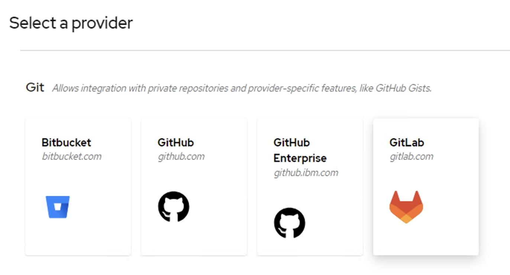

- Similarly, it is possible to deploy directly a business process onto a dedicated DEV environment. For now, the following options are available within Canvas:

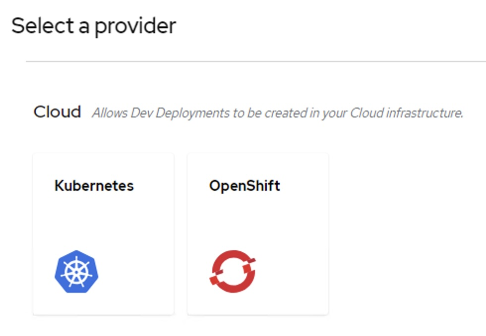

Note that for Production, CI/CD pipelines would be needed because deployment should not be done directly from Canvas.


**This completes the BAMOE 9.1 lab.**